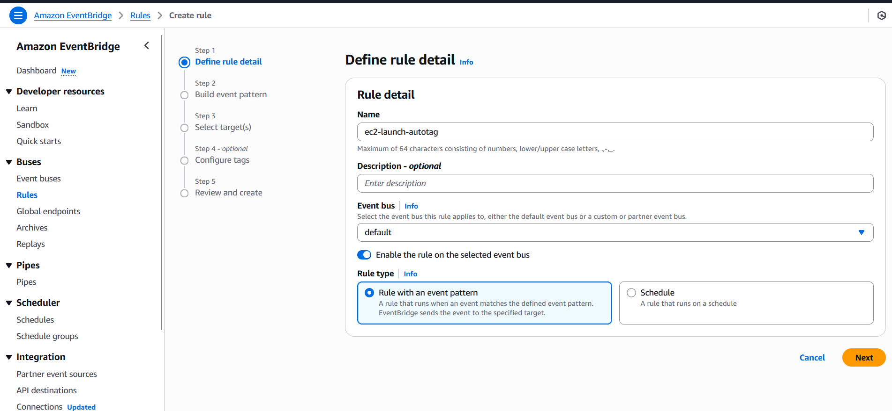

# Assignment 5: Auto-Tag EC2 Instances on Launch Using AWS Lambda & Boto3

## Objective
Automatically tag newly launched EC2 instances with custom metadata like launch time, environment, and creator using AWS Lambda and Boto3.

---

## Steps Followed

### Step 1: IAM Role for Lambda
- Created role: `lambda-ec2-autotagger-role`
- Attached policy: `AmazonEC2FullAccess`

> 💡 In production, use a scoped-down policy with only `ec2:CreateTags` and `ec2:DescribeInstances` permissions.


---

### Step 2: Lambda Function Setup
- Function Name: `AutoTagEC2OnLaunch`
- Runtime: Python 3.12
- Timeout: 1 minute
- Assigned the IAM role created above


---

### Step 3: Configure CloudWatch EventBridge Rule
- Go to Amazon EventBridge > Rules > Create Rule
- Rule Name: ec2-launch-autotag
- Event Source: AWS Events
- Event Pattern:
    ```json
    {
  "source": ["aws.ec2"],
  "detail-type": ["AWS API Call via CloudTrail"],
  "detail": {
    "eventName": ["RunInstances"]
        }
    }
- Target: Lambda function → AutoTagEC2OnLaunch





### Step 4: Real Event Test
- Launched a new EC2 instance
- Verified that the following tags were automatically added:
    - LaunchedBy: Lambda-AutoTag
    - Environment: dev


## Results
- The Lambda function successfully executed and added the required tags to the newly launched EC2 instance.
- The CloudWatch EventBridge rule triggered the Lambda function upon the EC2 instance launch event.
- The tags were correctly added to the instance, demonstrating the automation of the tagging process.
- The solution meets the requirements by automating the tagging process for EC2 instances upon launch, ensuring consistency and reducing manual effort.

- Output:
- Tags: LaunchedBy: Lambda-AutoTag, Environment: dev

